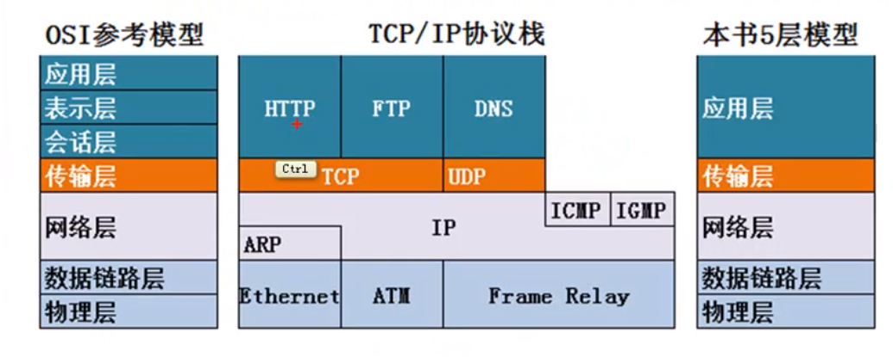
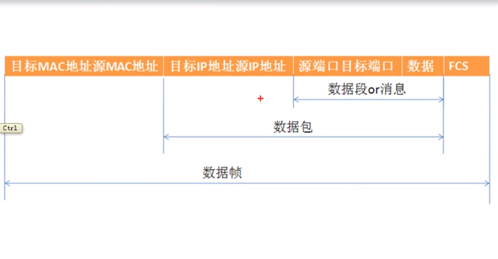

##  计算机网络概述

- 局域网：覆盖范围小，自己花钱购买设备，带宽固定 ，自己维护  `100米以内,带宽 10M,100M,1000M

  *接入层交换机、汇聚层交换机*

- 广域网：距离比较远，花钱租带宽，他人维护

- Internet： 由多个ISP组成，有自己的机房，对网民提供访问 Internet连接

`子网掩码：区分网络部分和主机部分`

 路由器：在不同网段转发数据

IP地址：表明目的地  

MAC物理地址：48位二进制，唯一，表明下一跳地址

### OSI参考模型

- 应用层：所有能 `产生网络流量 `的程序
- 表示层：：在传输之前是否进行加密或压缩处理
- 会话层：查木马 netstat -n  查看会话
- 传输层：可靠传输，流量控制，也可进行不可靠传输
- 网络层：负责选择最佳路径，规划IP地址（也可用静态路由指定路线） `IPV4 和IPV6 只在网络层改变了`
- 数据链路层：定义帧的开始和结束 ，透明传输，差错校验
- 物理层：定义网络设备的接口标准，电气标准，如何在物理链路传输更快的速度 

`下层为上层提供服务`

### OSI参考模型对网络排错指导

1. 物理层故障：查看链接状态，发送和接受的数据包
2. 数据链路层故障：MAC冲突，ADSL欠费，网速没办法协商一致，计算机连接到错误的VLAN
3. 网络层故障：配置错误的IP地址、子网掩码和网关，路由器上没有配置到达目标的路由
4. 应用层故障（包含所有的其余层）：应用程序配置错误

### OSI参考模型和网络安全

1. 物理层安全
2. 数据链路层安全：ADSL的账号密码   VLAN   交换机端口绑定MAC地址
3. 网络层安全：在路由器上使用ACL(访问控制列表）控制数据流量包
4. 应用层安全：开发的应用程序没有漏洞

### TCP/IP协议和OSI参考模型

`物理层和数据链路层统称为网络接口层`

`ARP为IP提供服务， IP为ICMP、IGMP提供服务`

### 计算机网络的性能指标

1. 速率：连接在计算机网络上的主机在数字信道上传送数据位数的速率

2. 带宽：数据通信领域中，数字信道所能传送的最高速率

3. 吞吐量：在单位时间内通过某个网络的数据量

4. 时延

   - 发送时延（带宽影响发送时延）
   - 传播时延
   - 处理时延
   - 排队时延

5. 时延带宽积  $时延带宽积 = 传播时延 × 带宽$ 表示线路上的数据

6. 往返时间：从发送方发送数据开始，到发送方收到接收方确认

7. 利用率

   - 信道利用率：$\frac{有数据通过时间}{(有+无)数据通过时间}$

   - 网络利用率：信道利用率加权平均 

     $D = \frac{D_0}{1 - U}$

     $D_0$ 表示网络空闲时的时延；D表示网络当前的时延；U表示信道利用率

   