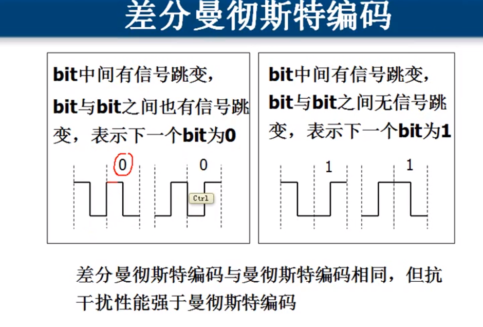
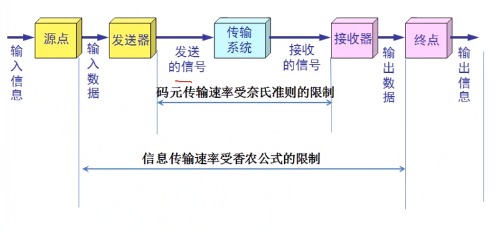
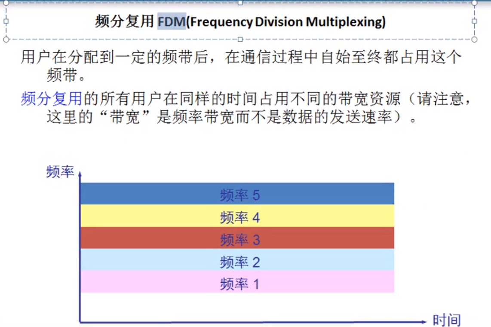
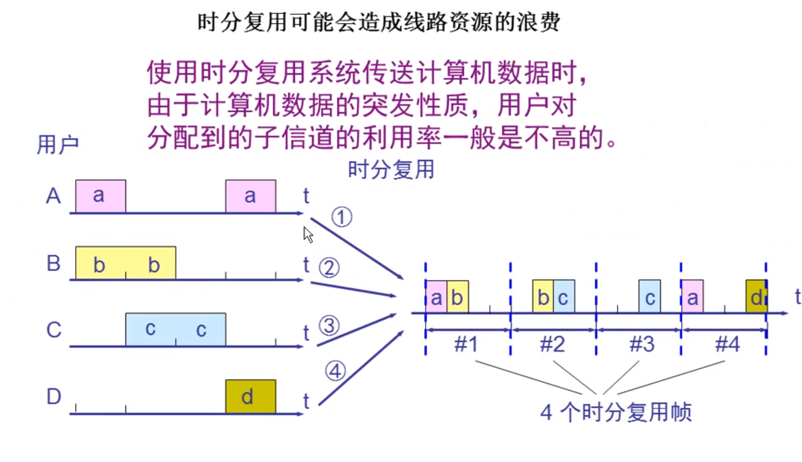
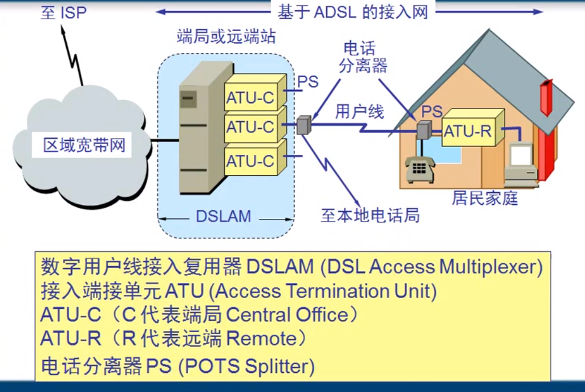

## 第二章 物理层

1. ### 物理层的基本概念

   物理层解决如何在连接各种计算机的传输媒体上传输数据比特流，而不是指具体的媒体传输；

   物理层的主要任务：确定传输媒体的接口的一些特性：

   - 机械特性：例：接口形状，大小，引线数目
   - 电气特性：例：规定电压范围（-5V到+5V）
   - 功能特性：例：规定-5V表示0，+5V表示1
   - 过程特性：也称规程特性，规定建立连接时各个相关部件的工作步骤	

2. ### 数据通信的基础知识

   

   #### 相关术语

   通信的目的是传送消息

   数据（data）——运送消息的实体

   信号（signal）——数据的电气的或电磁的表现

   - “模拟信号“——代表消息的参数的取值是连续的
   - “数字信号”——代表消息的参数的取值是离散的

   码元（code）——在使用时间域的波形表示数字信号时，代表不同离散数值的基本波形就称为码元

   在数字通信中常常用时间间隔相同的符号的来表示一个二进制数字，这样的时间间隔内的信号称为二进制码元。而这个间隔被称为码元长度。1码元可以携带n bit 的信息量

   

   信道一般表示像一个方向传送信息的媒体。平常所说的通信线路往往包含一条发送信息的信道和一条接受信息的信道；

   单向通信（单工通信）——只能有一个方向的通信而没有反方向的交互

   双向交替通信（半双工通信）—— 通信的双方都可以发送信息，但不能双方同时发送（当然也就不能同时接收）

   双向同时通信（全双工通信）——通信的双方可以同时发送和接收信息

   

   基带信号 ------通过调制------> 带通信号

   集中最基本的调制方法

   - 调幅（AM）：载波的振幅随基带数字信号而变化
   - 调频（FM）：载波的频率随基带数字信号而变化
   - 调相（PM）：载波的初始相位随基带数字信号而变化

   

   常用编码

   

   

   

   奈奎斯特提出奈氏准则：在假定的理想条件下（没有电磁干扰），为了避免码间串扰，码元的传输速率的上限值。

   香农用信息论的理论推导出了带宽受限且有高斯白噪声干扰的信道的极限、无差错的信息传输速率。 

   $C = W \log_2 (1 + S/N) b/s$

   C:信道的极限信息传输速率；W：信道的带宽（Hz) 	S:信道内所传信号的平均功率；	N：信道内部的高斯噪声功率   	S/N 信噪比

   

3. ### 物理层下面的传输媒体

   1. 导向传输媒体
   2. 非导向传输媒体

4. ### 信道复用技术

   - 频分复用FDM

     

   - 时分复用（TDM）

     

     

     

   - 波分复用（WDM)

     

     

5. ### 数字传输系统

   T1：北美24路PCM	E1：欧洲30路PCM

6. ### 宽带接入技术

    ADSL：非对称数字用户线路

   

   