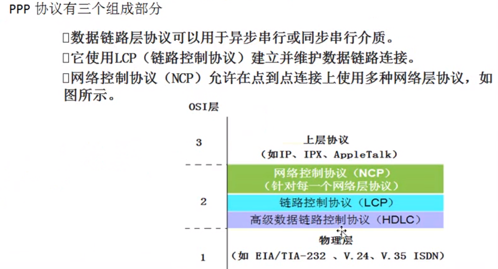
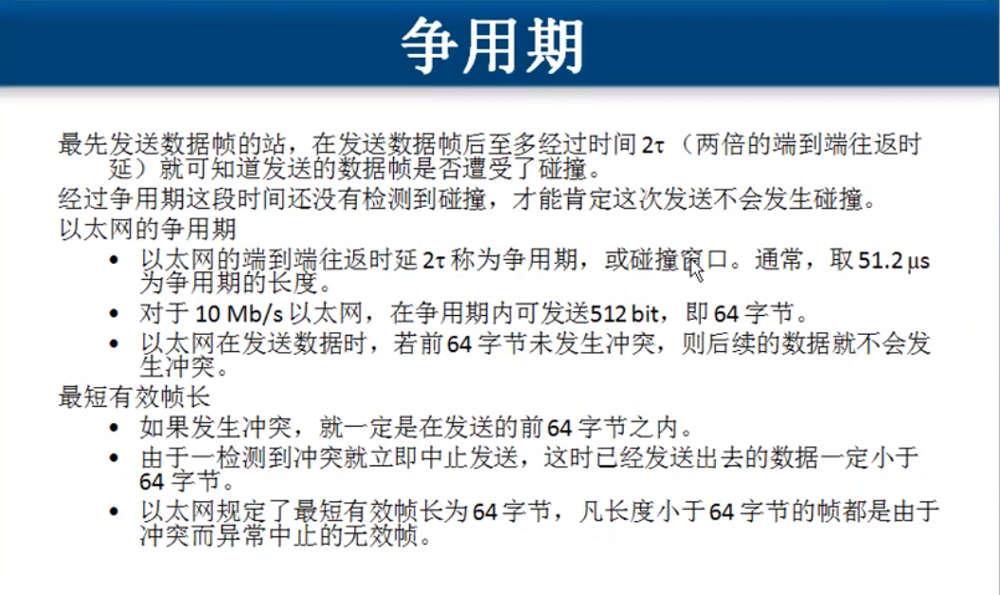
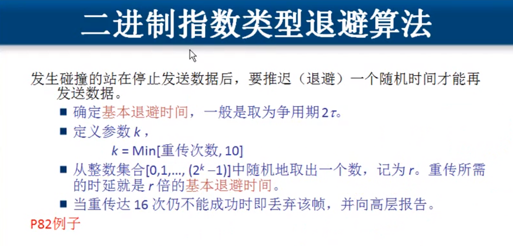
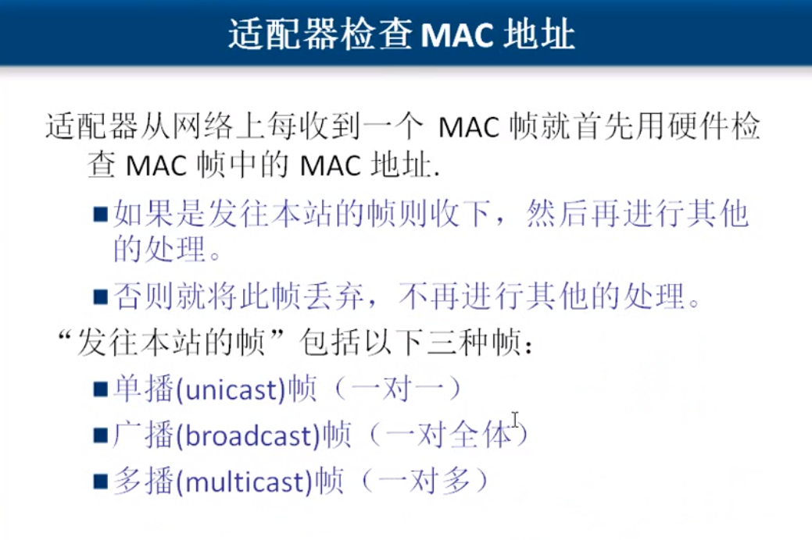

##  数据链路层

### 数据链路层的基本概念

#### 数据链路层使用的信道类型：

1. 点对点信道：这种信道使用一对一的点对点通信方式；
2. 广播信道：这种信道使用一对多的广播通信方式，因此过程比较复杂。广播信道上连接的主机比较多，因此必须使用专用的共享信道协议来协调这些主机的数据发送。

链路：一条点到点的物理线路段，中间没有任何其他的交换节点。（一条链路知识一条通路的一个组成部分）

数据链路：出了物理线路外，还必须有通信协议来控制这些数据的传输。若把实现这些协议的硬件和软件加到链路上，就构成了数据链路。

数据链路层传送的是 `帧`：帧头、帧尾、物理层地址、校验值

#### 三个基本问题

1. 封装成帧：控制字符进行帧定界

2. 透明传输：字节填充解决透明传输的问题

3. 差错控制 ：*传输过程中可能会产生 `比特差错`，1可能变成0,0也可能变成1。在一段时间内，传输错误的比特占所传输比特综述的比率称为 `误码率 （BER Bit Error Rate)`* 

   循环冗余算法（CRC）

在数据后面添加上冗余码称为`帧检验序列`。

### 两种情况下的数据链路层

#### 点到点通信数据链路层协议PPP(大多用于广域网)

字节填充、零比特填充

####  使用广播信道的数据链路层（局域网）

共享通信媒体

1. 静态划分信道
   - 频分复用
   - 时分复用
   - 波分复用
   - 码分复用（用一组包含互相正交的码字的码组携带多路信号）
2. 动态媒体接入控制（多点接入）
   - 随机接入（主要被以太网采用）
   - 受控接入，如多点线路探寻（polling），或轮询。（目前已不被采用）

以太网使用CSMA/CD协议 (载波监听多点接入/碰撞检测)

- 多点接入：许多计算机以多点接入的 方式连接在一根总线上
- 载波监听：每一个站在发送数据之前先要检测一下总线上是否有其他计算机在发送数据。

使用CSMA/CD协议的以太网不能进行全双工通信，只能进行半双工通信。

### 以太局域网

### 扩展以太网

距离扩展：使用光纤

数量扩展：集线器级联，使网络中计算机数量增加，组建了一个大的冲突域

### 优化以太网

`网桥 -> 交换机`

交换机：端口带宽独享、安全、基于MAC地址转发、通过学习构建MAC地址表、存储转发、全双工 

