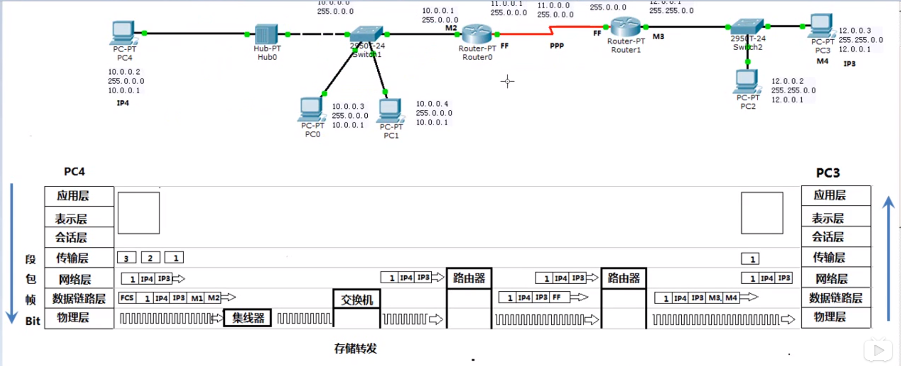
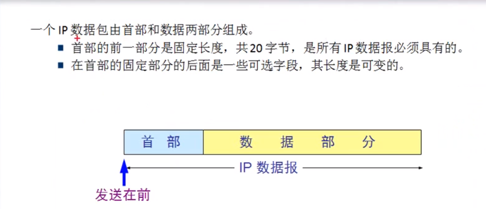
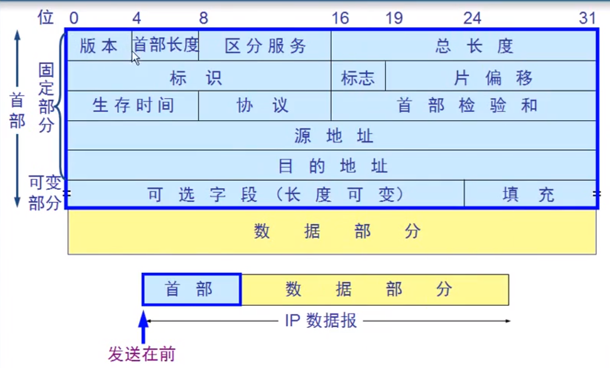

 

## 网络层

负责在不同网络之间尽力转发数据包，基于数据包的IP地址转发，不负责丢失重传，不负责顺序（传输层的事）

发送端

1. 应用程序：准备要传输的文件

2. 传输层 ：将文件分段、并编号

3. 网络层：添加目标IP地址、源IP地址

4. 数据链路层：两种情况

   使用自己的子网掩码，判断自己在哪个网段

   使用自己的子网掩码，判断目标地址在哪个网段

   - 如果是同一个网段，使用ARP协议广播解析目标IP地址的MAC
   - 如果不是同一个网段

### 网络层协议

- ARP协议：将IP地址通过广播，解析目标IP地址的MAC地址

- ICMP协议：Internet控制报文协议（Internet Control Message Protocol）

  ping：TTL  数据包的生存周期，过一个路由器减一，防止数据包在网络中无限循环 

  ​			更改数据包TTL时间，能够跟踪数据包途经的路由器

  pathping：跟踪数据包路径，计算丢包情况

  tracert： 跟踪数据包路径的命令

- IGMP协议：互联网组管理协议（IGMP，Internet Group Management Protocol）

  `点到点通讯`

  `广播`

  `组播 = 多播`

- IP协议

IP数据包

- 版本：用来表示TCP/IP协议的版本  v4  v6

- 首部长度：笃定部分（20字节） + 可变部分

- 区分服务：区分优先级

- 总长度：网络层数据包 最大65535个字节；

  数据链路层 数据帧1500个字节`考虑网络传输的负载有效性和高效性的均衡，人为规定的`  

  最大传输单元MTU(MTU)`最大传输单元(Maximum Transmission Unit,MTU)是指一种通信协议的某一层上面所能通过的最大数据报大小(以字节为单位)`

  数据包如果不分片，数据包数据最大不超过1480字节（目标地址：6字节；源地址：6字节；类型：2字节`里面包含的信息用来标志上一层使用的是什么协议，以便接收端把收到的MAC帧的数据部分上交给上一层的这个协议`；FCS：4字节）

- 标识：通过标识将分片的数据包整合起来

- 标志：标志数据是否分片 

- 片偏移：第一个字节的偏移量

- 生存时间：TTL   Linux 64  Windows128  Unix 255

- 协议：指出应将数据部分交给哪一个进程（ICMP：1、IGMP：2、TCP：6、UDP：17、IPv6:41、OSPF：89）

- 首部检验和：只检查首部，不检查数据

### IP协议

网络畅通的条件：数据包有去有回

- 静态路由：需要管理员告诉路由器所有没有直连的网路下一跳该给谁；

  ​				 缺点：适合小规模网络、不能够自动调整路由

- 动态路由

  - RIP协议：周期性广播路由表，30秒更新一次；跳数越少，路径越好；最大跳数 15跳
  - OSPF协议：选择最佳路径的标准：带宽