## 传输层

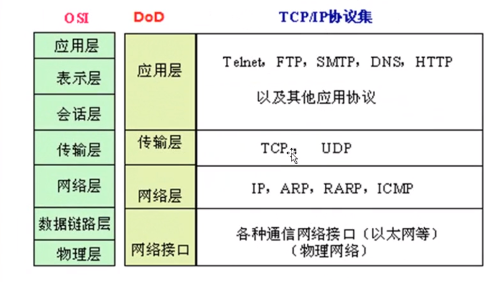

TCP：分段、编号、流量控制、建立会话

UDP:一个数据包就能完成数据通信、不建立会话、多播

传输层和应用层之间的关系：

- http = TCP + 80
- https = TCP + 443
- ftp = TCP + 21
- SMTP = TCP + 25
- POPS = TCP + 110
- RDP = TCP + 3389
- 共享文件夹 = TCP + 445
- SQL = TCP + 1433
- DNS = UDP + 53 or TCP + 53

应用层协议和服务之间的关系：服务运行后在TCP或UDP的某个端口侦听客户端请求

端口代表服务

更改端口增加服务器安全

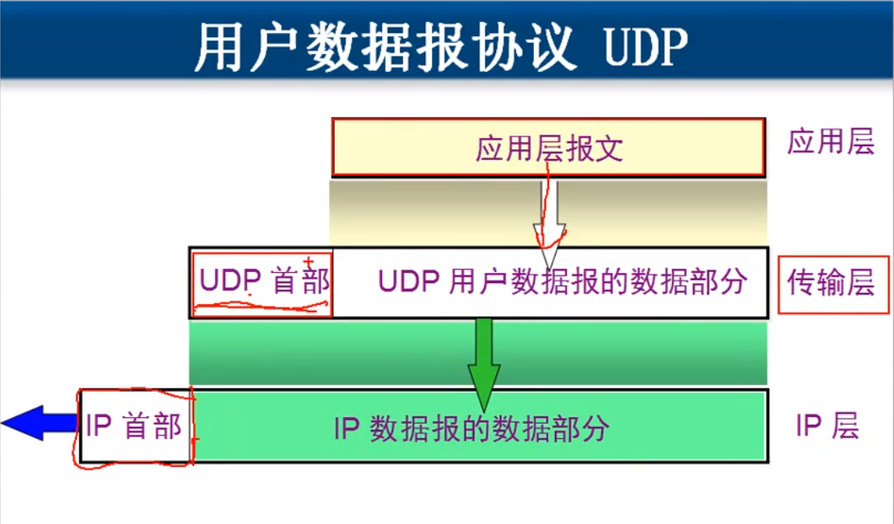

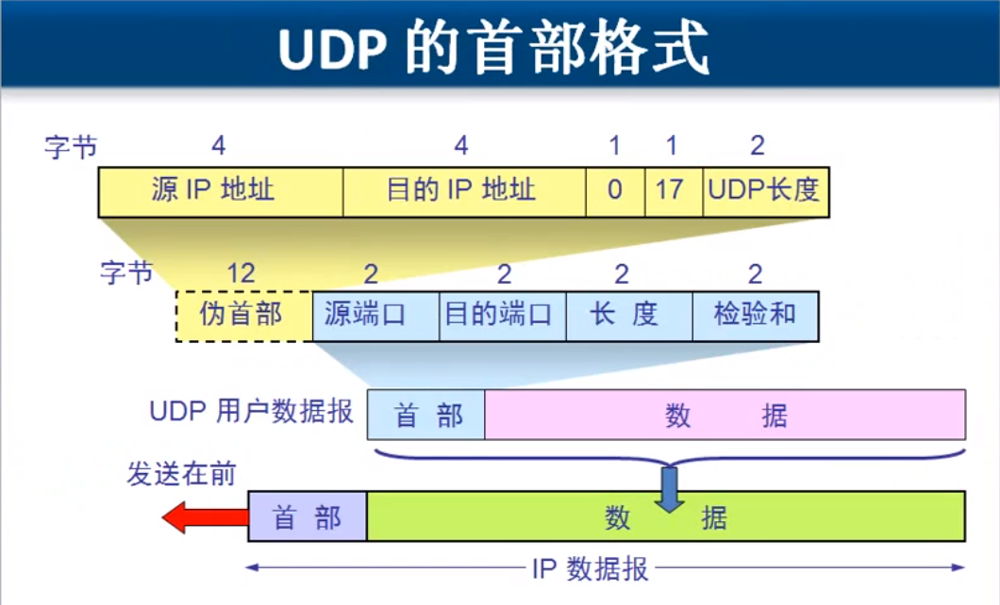

### TCP协议特点

- TCP如何实现可靠控制传输
- TCP协议如何实现流量控制
- TCP协议如何避免网络拥塞

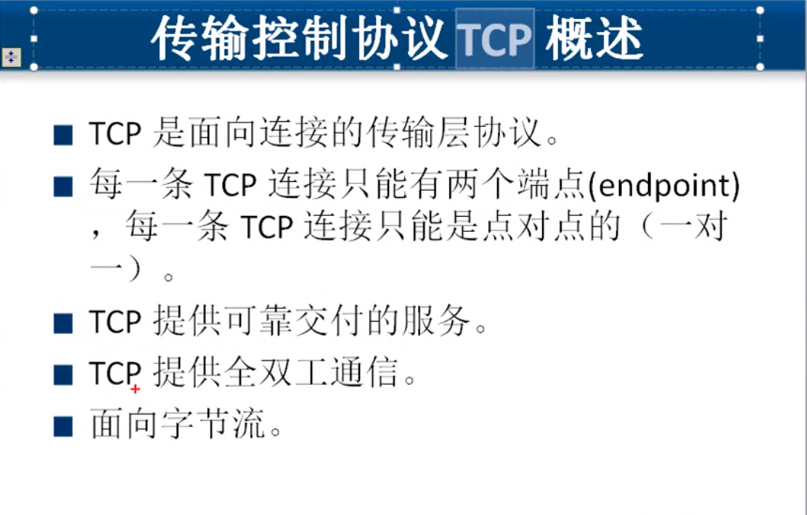

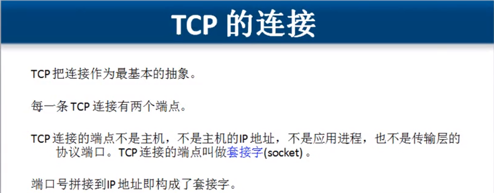

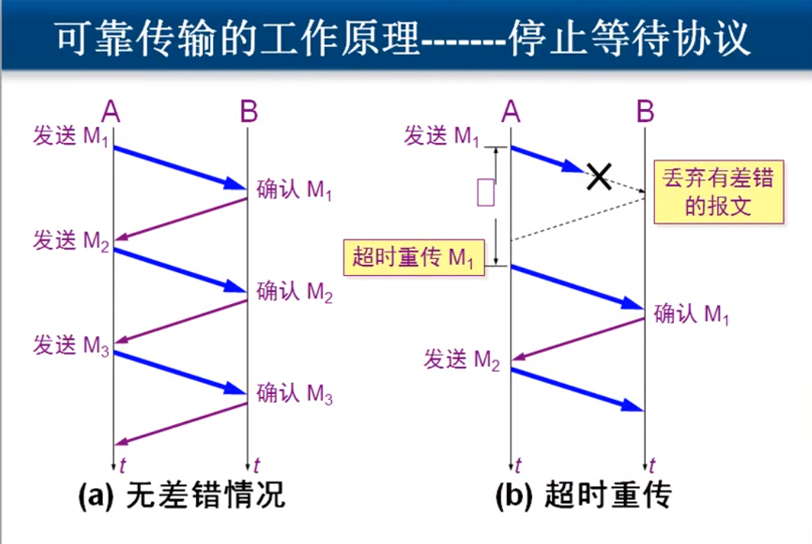

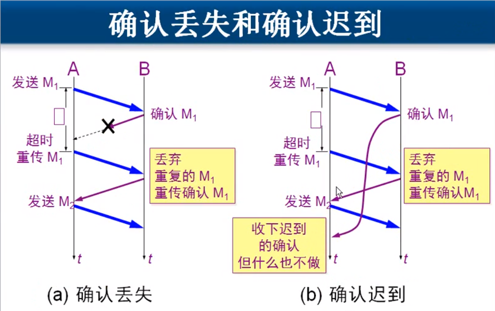

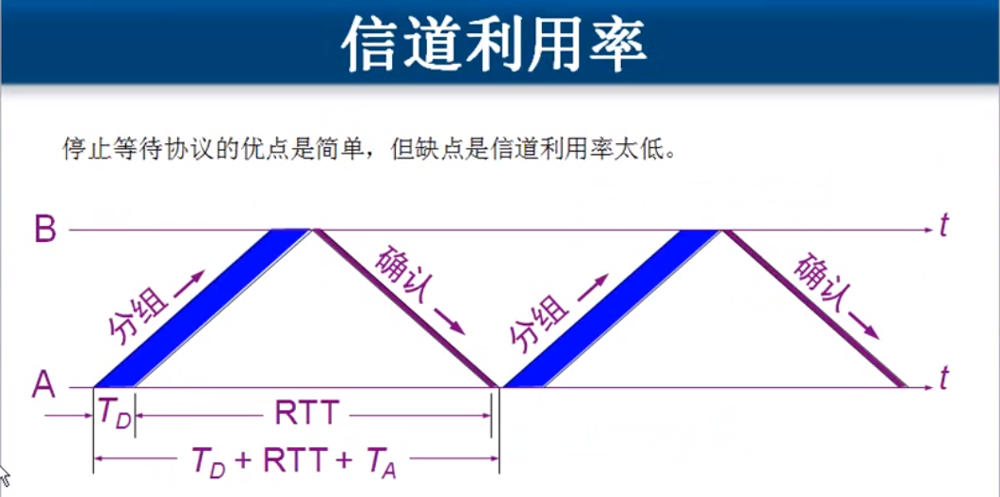
$$
信道利用律U = \frac{T_D}{T_D + RTT + T_A }
$$
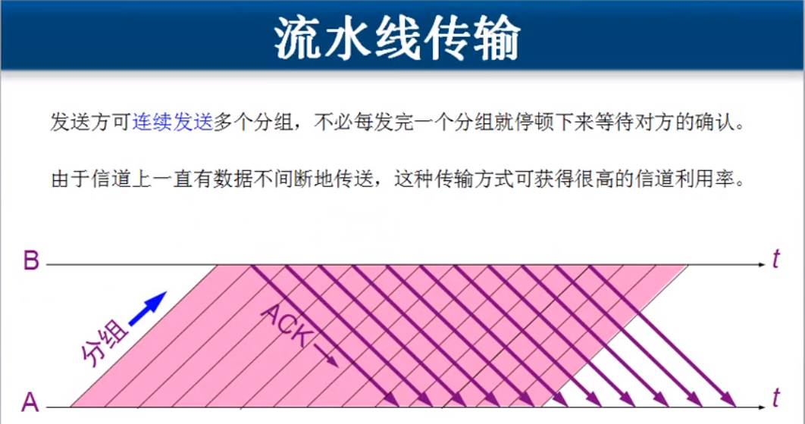

#### 累计确认

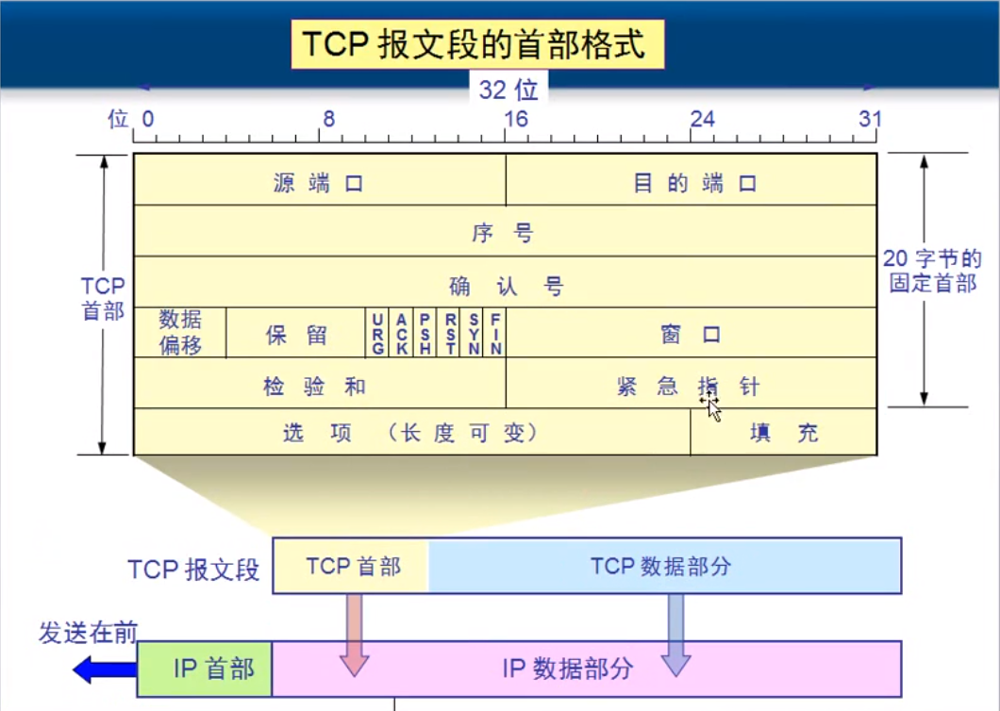

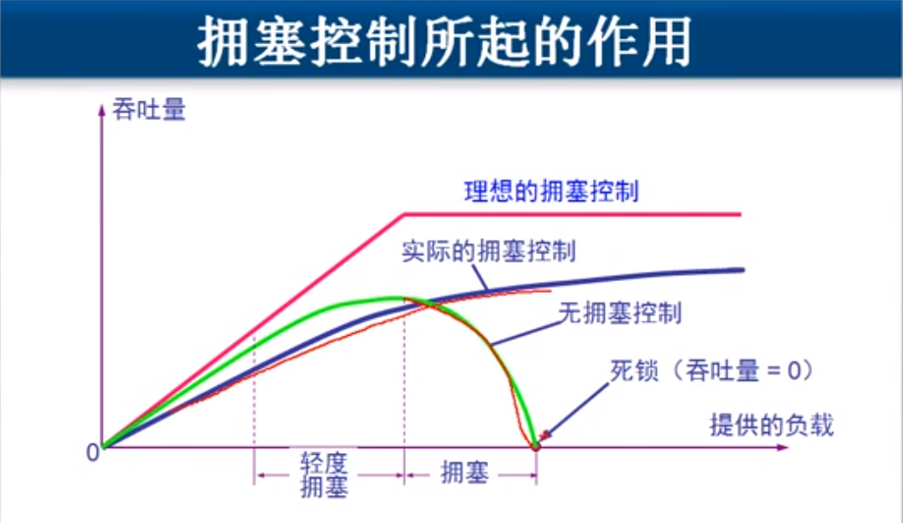

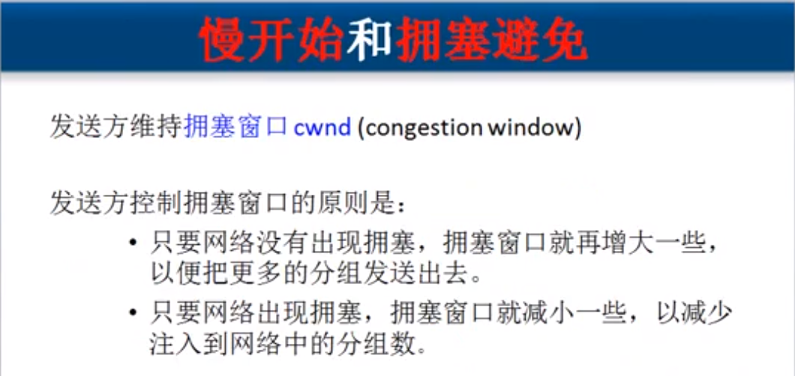

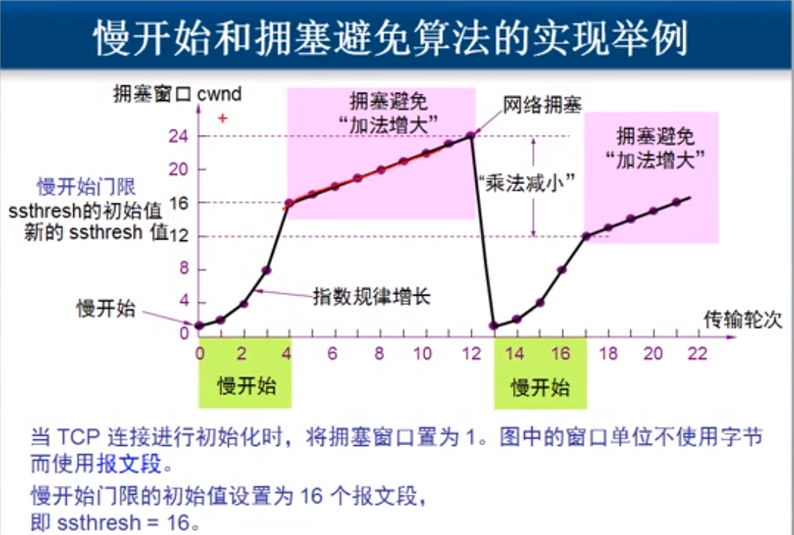

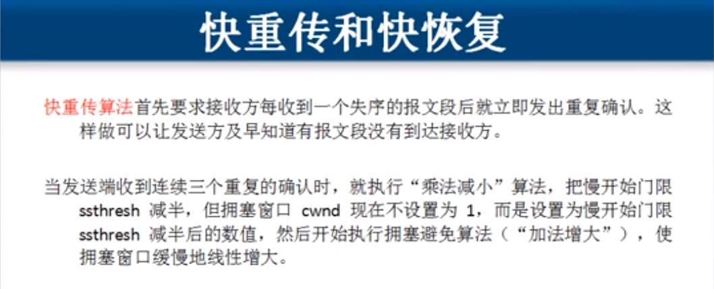

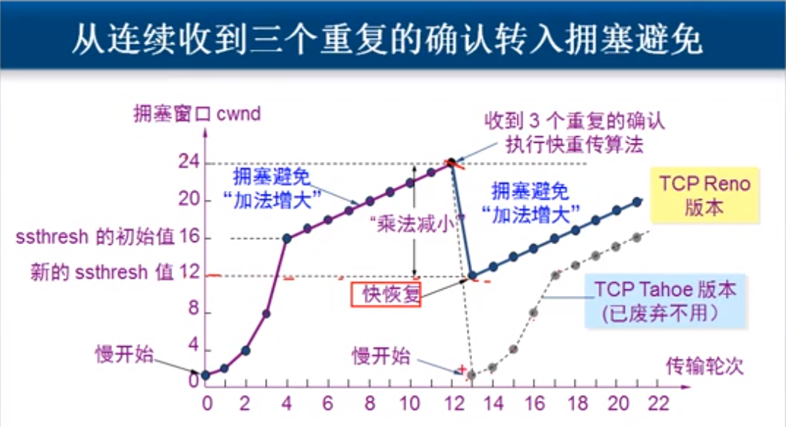

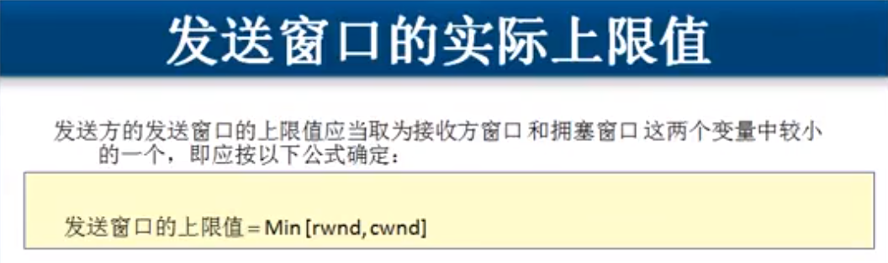

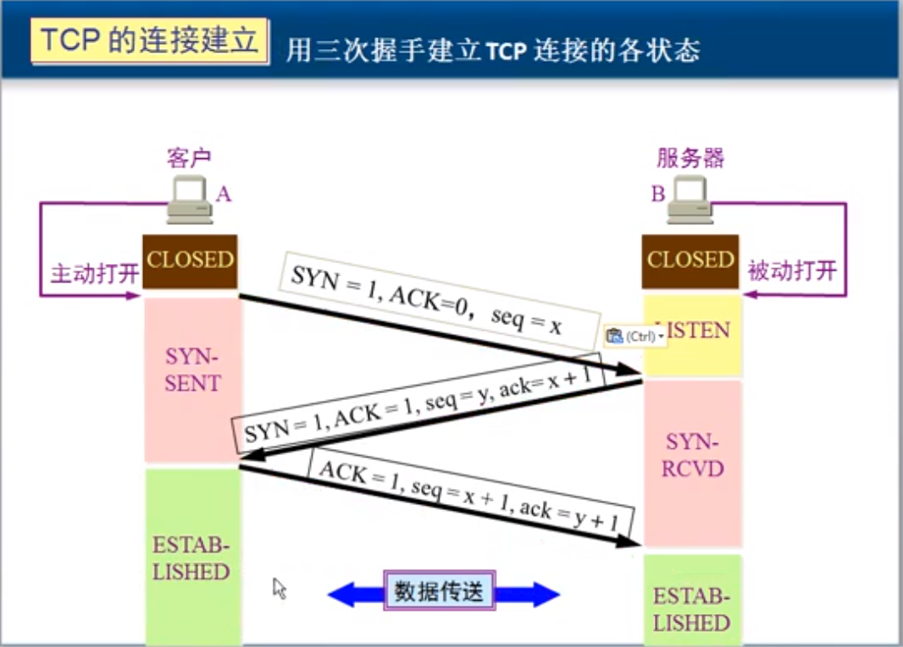

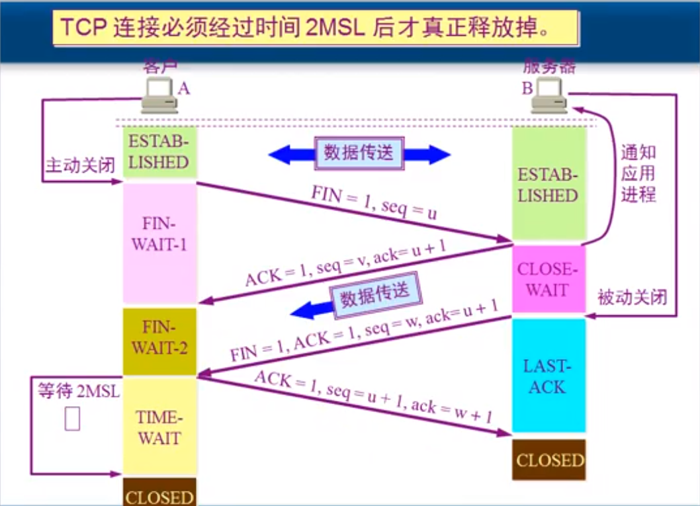