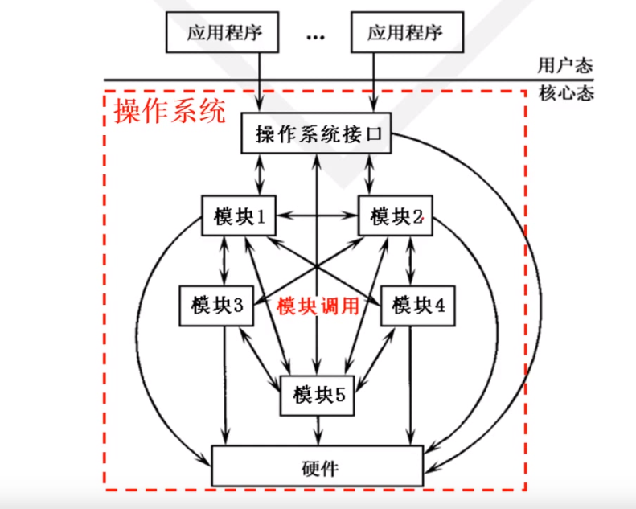

## 操作系统的逻辑结构

### 逻辑结构的种类

1. #### 整体式结构

   以模块为基本单位构建

   特点：

   - 模块设计、编码和调试独立
   - 模块调用自由
   - 模块通信多以 ` 全局变量` 形式完成

   缺点：

   信息传递随意，维护和更新困难

   

   

2. #### 层次式结构

   

   优点：

   - 结构清晰，避免循环调用；
   - 整体问题局部化，系统的正确性容易保证；
   - 有利于操作系统的维护、扩充、 `移植`；

   

3. #### 微内核结构（客户/服务器结构）

   操作系统 = 微内核 + 核外服务器

   微内核：足够小，提供OS最基本的核心功能和服务；

   - 实现与硬件紧密相关的处理；
   - 实现一些较基本的功能；
   - 负责客户和服务器间的通信；

   核外服务器：完成OS绝大部分服务功能，等待==应用程序==提出请求；

   - 由若干服务器或进程共同组成

###  支持操作系统的最基本的硬件

1. #### CPU

   - CPU态：

     - CPU的工作状态
     - 对资源和指令使用权限的描述

   - 态的分类

     - 核态（Kernel mode)

       - 能够访问所有资源和执行所有指令
       - 管理程序/OS内核

     - 用户态（User mode，目态）

       - 仅能访问部分资源，其他资源受限
       - 用户程序

     - 管态（Supervisor mode)

       介于核态和用户态之间

   - 硬件和OS对CPU的观察

     - 硬件按“态”来区分CPU的状态
     - OS按“进程”来区分CPU的状态

2. #### 内存

3. #### 中断

   

4. #### 时钟

### 补充

存储程序和数据的部件

分类：

- 按存储器（半导体存储器）读写工作方式：
  - RAM
  - ROM
- 按存储元的材料：
  - 半导体存储器（常做主存）
  - 磁存储器（磁带、磁盘）
  - 光存储器（光盘）
- 按与CPU的联系：
  - 主存（内存）：直接和CPU交换信息
  - 辅存：不能直接和CPU交换信息

==CPU三大总线：地址总线、数据总线、控制总线==
