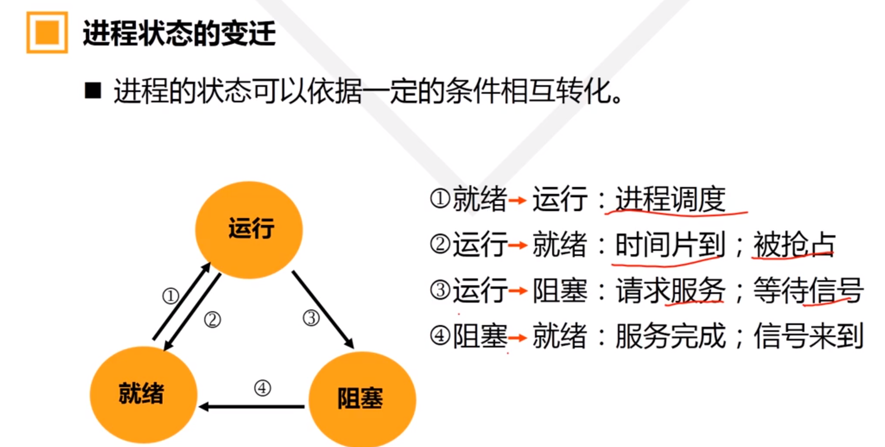
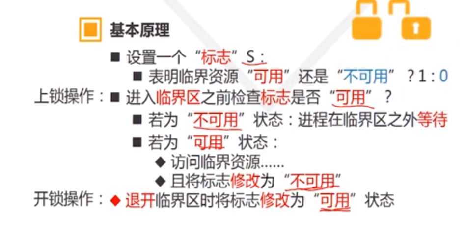
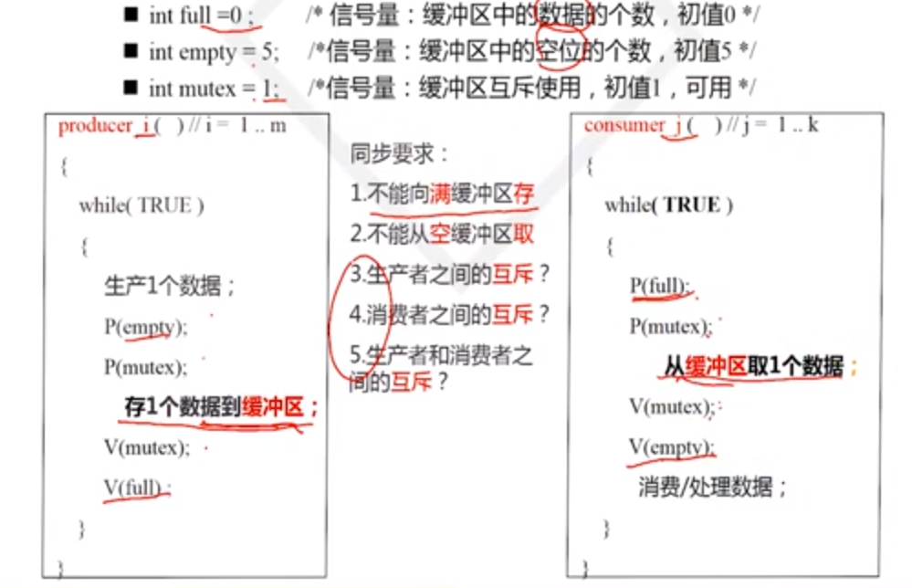
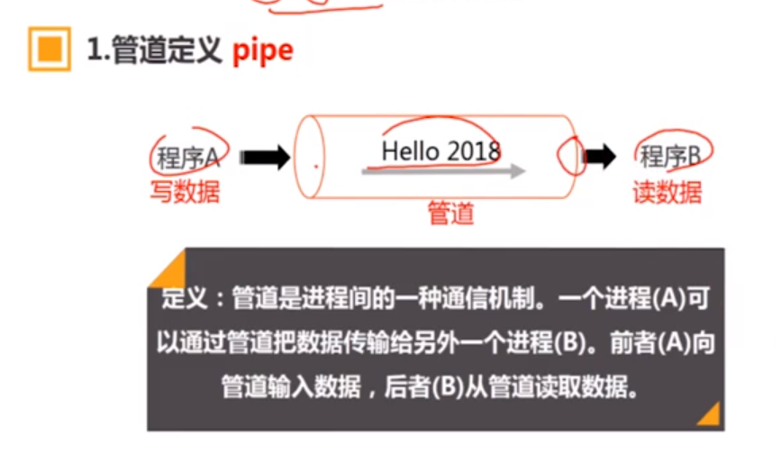
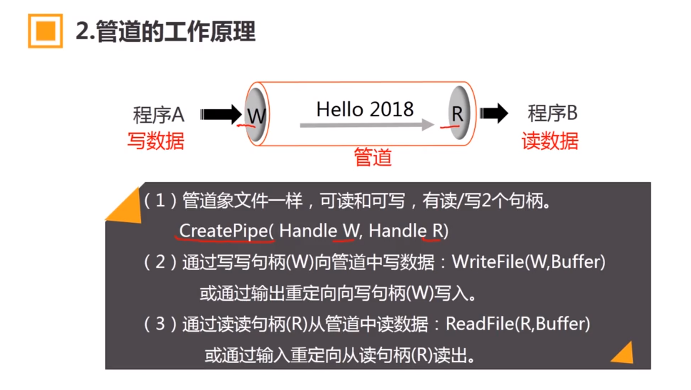
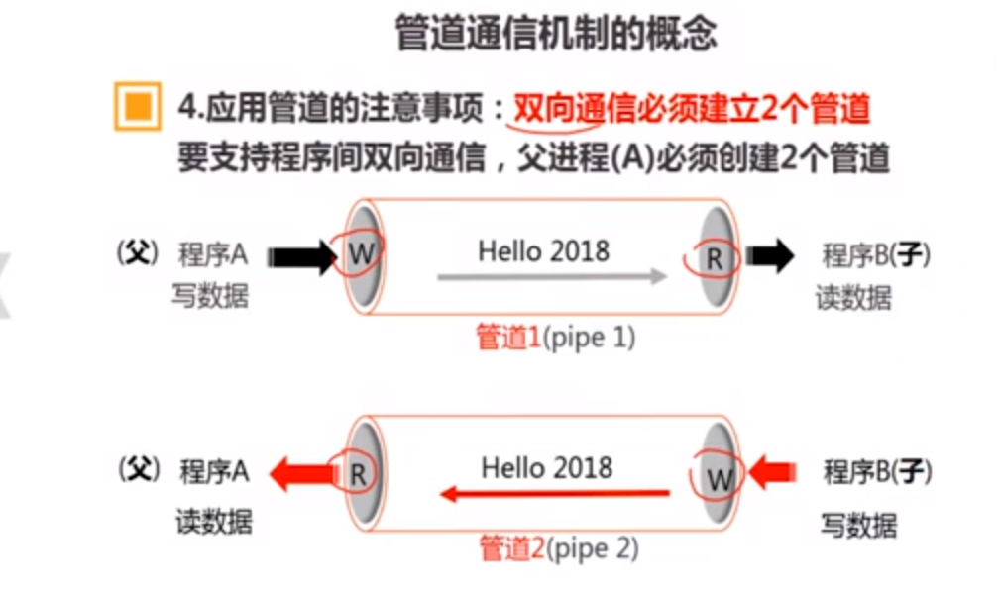

## 进程管理

1. ### 进程概念

   #### 进程的定义

   - 进程是程序在某个数据集合上的一次运行活动
   - 数据集合：软/硬件环境，多个进程共存/共享的环境 

   #### 进程的特征

   - 动态性：进程是程序的一次执行，动态产生/消亡；
   - 并发性：进程同其他程序一起向前推进；
   - 异步性：进程按照各自速度向前推进；
   - 独立性：进程是系统分配资源和调度CPU的单位；`（当计算机支持线程时，线程是调度CPU的单位）`

   #### 进程与程序

   - 动态与静态

     - 进程是动态的：程序的一次执行过程
     - 程序是静态的：一组指令的有序集合

   - 暂存与长存

     - 进程是暂存的：在内存驻留
     - 程序是长存的：在介质上长期保存

   - 程序和进程的对应：

     一个程序可能有多个进程

   #### 进程的分类

   - 按使用资源的权限
     - 系统进程：指系统内核相关的进程
     - 用户进程：运行于用户态的进程
   - 按对CPU的依赖性
     - 偏CPU进程：计算型进程
     - 偏I/O进程：侧重于I/O的进程

   #### 进程的状态

   1. #### 三态模型

      - 运行状态（Running)：进程已经占有CPU，在CPU上运行
      - 就绪状态 (Ready)：具备运行条件但由于无CPU，暂时不能运行
      - 阻塞状态（Block）：因为等待某项服务完成或信号不能运行的状态

      

   2. #### 五态模型

      新建态：进程刚刚被创建的状态

      终止态

      

   3. #### 七态模型

      挂起等待态

      挂起就绪态

      

   

   #### 进程的描述

   ##### 进程控制块（Process Control Block, PCB)

   描述进程状态、资源和与相关进程关系的数据结构

   - PCB是进程的标志
   - 创建进程时创建PCB；进程撤销后PCB同时撤销

   #### 进程的上下文

   Context，进程运行环境，CPU环境

   #### 进程切换过程

   - 换入进程的上下文，进入CPU（从栈上来）
   - 换出进程的上下文，离开CPU（到栈上去）

2. ### 进程控制

   #### 定义

   在进程生存期间，对其全部行为的控制

   #### 四个典型的控制行为

   - 创建进程
   - 撤销进程（递归，检查是否有子进程，先“撤销”子进程）
   - 阻塞进程
   - 唤醒进程

   #### 进程控制原语

   - 由若干指令构成的具有特定功能的函数
   - 具有原子性，其操作不可分割
   - 包括创建进程原语、撤销进程原语、阻塞进程原语、唤醒进程原语

3. ### 线程

   #### 概念

   1. 线程是可由CPU直接运行的实体；
   2. 一个进程可以创建多个线程；
   3. 多个线程共享CPU可以实现并发运行；

   #### 单线程程序和多线程程序

   单线程程序：整个进程只有一个线程（主线程，main线程）

   多线程程序：整个进程至少有两个线程。主线程和至少一个用户线程

   #### 线程技术适用场景

   - 程序的多个功能需要并发运行
   - 提高窗口程序的交互性
   - 需要改善程序结构的地方
   - 多核CPU上的应用，充分发挥多核性能

   #### 使用线程的麻烦

   - 程序难以调试
   - 并发过程难以控制
   - 线程安全问题

4. ### 临界区和锁

   #### 临界资源与临界区

   临界资源：一次只允许一个进程访问独占（使用）的资源 *（例子中的共享变量i）*

   临界区：进程中访问临界资源的程序段

   访问特点：

   - 具有排他性
   - 并发进程不能同时进入临界区

   临界区访问机制的四个原则

   1. 忙则等待：当临界区忙时，其他进程必须在临界区外等待
   2. 空闲让进：当无进程处于临界区时，任何有权进程可进入临界区
   3. 有限等待：进程进入临界区的请求应在有限时间内得到满足
   4. 让权等待：等待进程放弃CPU(让其他进程有机会得到CPU)

   #### 锁机制

   

5. ### 同步和P-V操作

   #### 进程互斥关系

   - 多个进程由于共享了独占性资源，必须协调各进程对资源的存取顺序：确保没有任何两个或以上的进程同时进行存取操作；
   - 互斥和资源共享相关
   - 资源：临界资源
   - 存取操作区域：临界区

   #### 进程同步关系

   若干合作进程为了完成一个共同任务。需要相互协调运行步伐：一个进程开始某个操作之前必须要求另一个进程已经完成某个操作，否则前面的进程只能等待

   互斥关系属于特殊的同步关系

   #### P-V 操作

   

   

   

   #### P-V 操作解决互斥问题

   实质是实现对临界区的互斥访问：允许最多一个进程处于临界区

   应用过程：

   - 进入临界区之前先执行P操作（可能阻塞当前进程）
   - 离开临界区之后在执行V操作（可能唤醒某个进程）

   #### P-V 操作解决同步问题

   实质：

   - 运行条件不满足时，能让进程暂停
   - 运行条件满足时，能让进程立即继续

   基本思路：

   - 暂停当前进程：在关键操作之前执行P操作*（必要时可暂停）*
   - 继续进程：在关键操作之后执行V操作 *(必要时唤醒合作进程）*
   - 定义有意义的信号量S，并设置合适的初值：信号量S能明确的表示“运行条件”

   

6. ### 经典问题

   1. 生产者和消费者

      

   2. Reader 和 Editor 问题

      

7. ### 进程通信

   #### 匿名管道 

   

   

   

   
