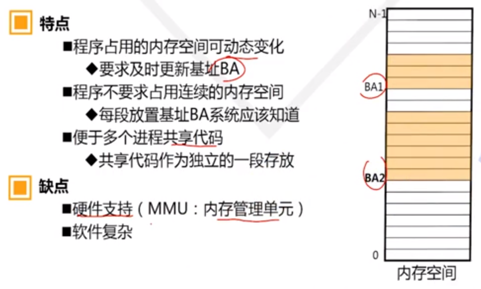
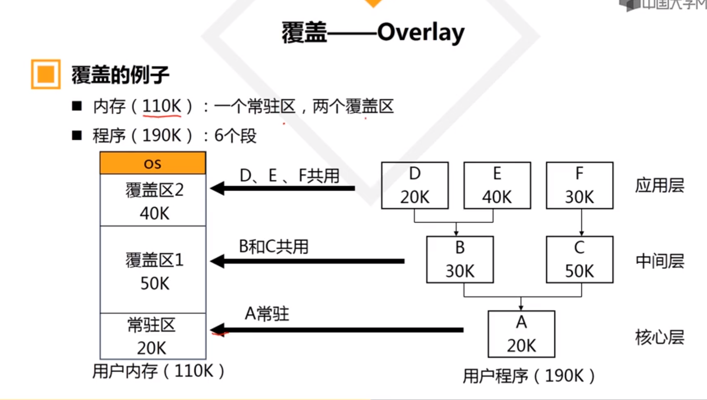
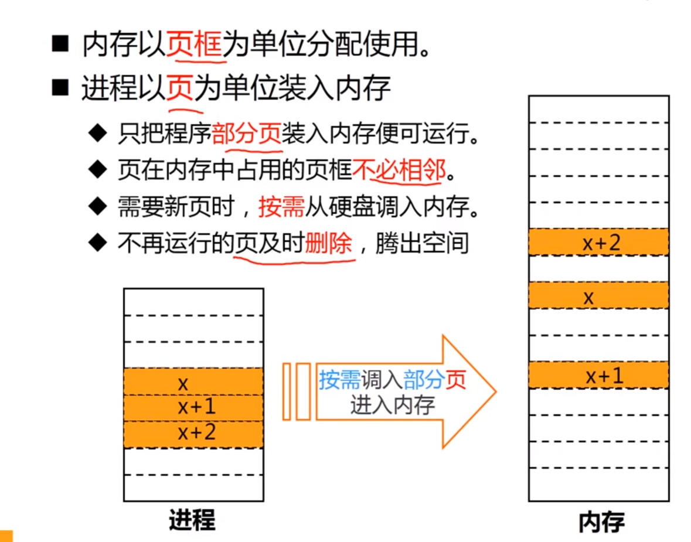
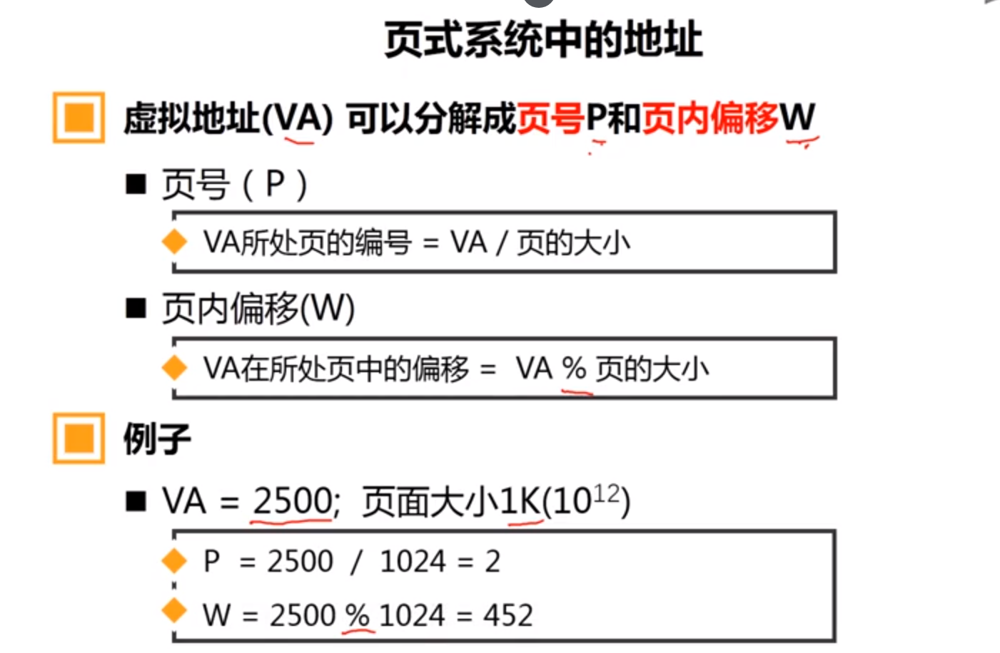
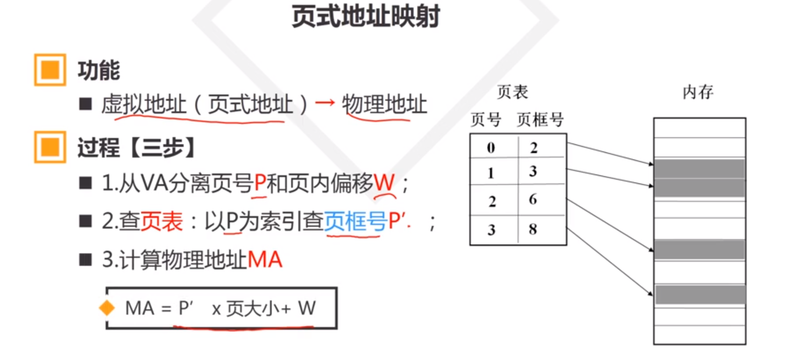
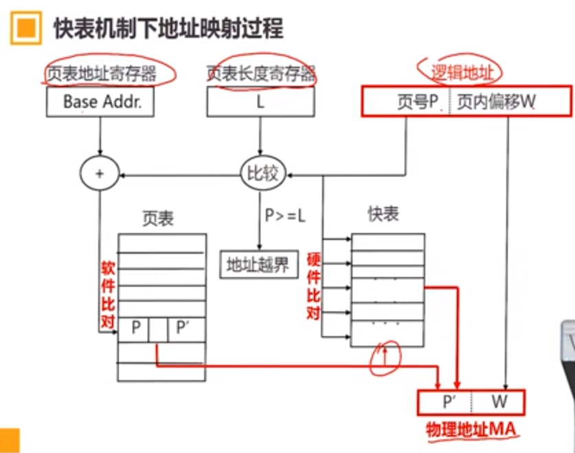
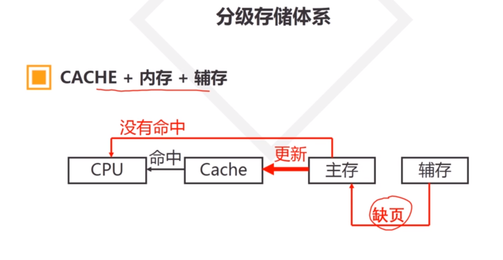
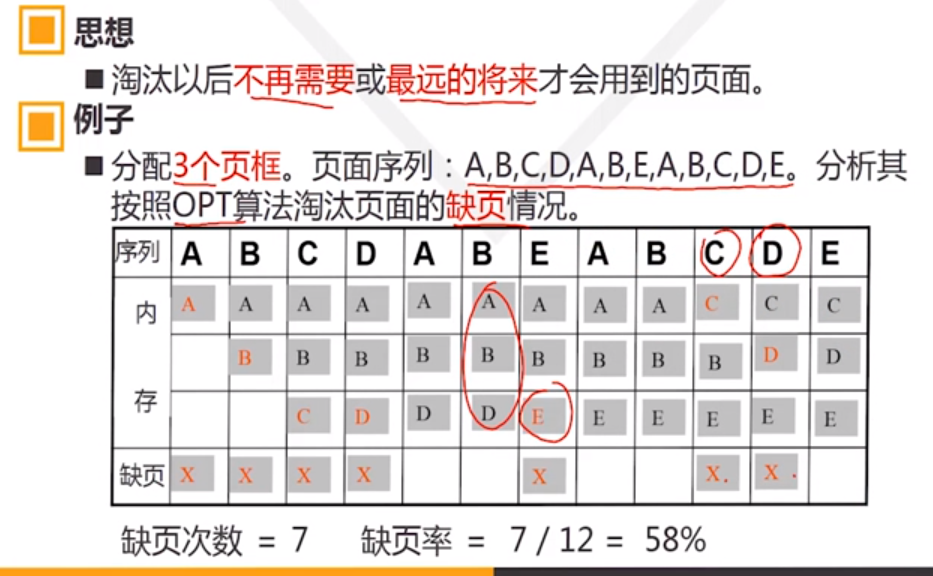

##  存储管理

1. ### 内存管理功能

   

   ####   存储管理的功能

   1. ##### 地址映射

      定义：把程序中的地址（虚拟地址/虚地址/逻辑地址）变换成内存的真实地址（实地址/物理地址）的过程

      也叫：地址重定位、地址重映射

      方式

      - ###### 固定地址映射

        定义：编程或编译时确定逻辑地址和物理地址映射关系

        特点：

        - 程序加载是必须放在指定的内存区域
        - 容易产生地址冲突，运行失败

      - ###### 静态地址映射

        定义：程序 `装入时` 由操作系统完成逻辑地址到物理地址的映射

        逻辑地址：VA	装入基址：BA	物理地址：MA

        MA = BA + VA 

        特点：

        - 程序运行之前确定映射关系
        - 程序装入后不能移动，如果移动必须放回原来位置
        - 程序占用连续的内存空间

      - ###### 动态地址映射 

        定义：在程序 `执行过程中` 把逻辑地址转换为物理地址

        逻辑地址：VA	装入基址：BA	物理地址：MA

        MA = BA + VA 

        如果程序有移动，BA可能会有改变，自动计算新的MA

         

   2. ##### 虚拟存储

      概念：虚拟内存是面向用户的虚拟封闭存储空间

   3. ##### 内存分配的功能

   4. ##### 存储保护功能

2. ### 物理内存管理

   

   #### 分区存储管理

   - ##### 单一区存储管理 （不分区存储管理）

     定义：用户去不分区，完全被一个程序占用

     优点：简单，不需要复杂硬件支持，适用于单用户单任务OS

     缺点：程序运行占用整个内存，即使小程序也是如此，内存浪费，利用率低

   - ##### 分区存储管理

     定义：把用户区内存年划分为若干大小不等的分区，供不同程序使用

     - ###### 固定分区

       定义：把内存 `固定` 的划分为若干个大小不等的分区供各个程序使用。每个分区的大小和位置都固定，系统运行期间不再重新划分

       分区表：记录分区的位置、大小和使用标志

       特点：

       - 在程序装入前，内存已被分区，不再改变
       - 每个分区大小不同，适应不同大小的程序
       - 系统要维护分区表

       缺点：

       - 浪费内存：程序比所在分区小
       - 大程序可能无法运行：程序可能比最大分区大

       建议：根据分区表安排程序装入顺序，使每个程序都能找到合适的分区运行

     - ###### 动态分区

       定义：在程序 `装入时` 创建分区，使分区大小刚好和程序的大小相等

       特点:分区动态建立

       - 分区的个数和大小均可变
       - 存在内存碎片

       需要解决的问题：

       - 分区的分配

         空闲区表：描述内存空闲区的位置和大小的数据结构

         放置策略（空闲区表排序原则）

         - 按空闲区位置（首址）递增排序 ——首次适应算法
         - 按空闲区位置（首址）递减排序
         - 按空闲区大小的递增排序 —— 最佳适应算法
         - 按空闲区大小的递减排序—— 最坏适应算法

       - 分区的选择

       - 分区的回收

         功能：回收程序释放分区（释放区），登记到空闲区表中，以便再分配

         回收算法：

         - 考虑释放区与现有空闲区是否相邻？
         - 若不相邻，则直接插入空闲区表
         - 若相邻，则与空闲区合并后更新空闲区表

       - 内存碎片问题

   #### 内存覆盖技术 ——Overlay

   目的：在较小的内存空间运行较大的程序

   内存分区：

   - 常驻区：被某段单独且固定的占用，可划分多个
   - 覆盖区：能被多段共用（覆盖），可划分多个

   

   缺点：

   - 编程复杂：程序员划分程序模块并确定覆盖关系
   - 程序执行时间长：从外存装入内存耗时

   #### 内存交换技术——Swapping

   原理：

   内存不够时把进程写到磁盘（换出/Swap Out），当进程要运行时重新写回内存（换入/Swap In）

   优点：

   - 增加进程并发数
   - 不考虑程序结构（以进程为单位）

   缺点：

   换入和换出增加CPU开销

   交换单位太大（整个进程）

   需要考虑的问题：

   - 减少交换传送的信息量（模块/段）
   - 外存交换空间的管理方法
   - 程序换入时的 `地址重定位` 

   #### 内存碎片 

   解决方法：

   1. 规定门限值：分割空闲区时，若剩余部分小于门限值，则此空闲区不进行分割，而是全部分配给用户

   2. 内存拼接技术：将所有空闲区集中一起构成一个大的空闲区

      拼接的时机：

      - 释放区回收的时候：拼接频率过大，系统开销大
      - 系统找不到足够大的空闲区时：空闲区的管理复杂
      - 定期：空闲区的管理复杂

   3. 解决程序占用连续内存才能运行的机制

      - 把程序分拆多个部分装入不同分区，充分利用碎片

3. ### 虚拟内存管理

   #### 实现思路

   在程序运行时，只把当前必要的很小一部分代码和数据装入内存中。其余代码和数据需要时在装入。不在运行的代码和数据及时从内存删除。

   #### 程序运行的局部性

   - 程序在一个有限的时间段内访问的代码和数据往往集中在有限的地址范围内

   - 把程序一部分装入内存在 `较大概率（因为程序可能跳转)` 上也足够让其运行一小段时间

     页式虚拟存储管理

   

   1. #### 页式虚拟存储管理

      把进程空间（虚拟）和内存空间划分成等大小的小片。

      进程的小片——页（虚拟页或页面）

      内存的小片——页框（物理页）

      

   2. #### 页表和页式地址映射

      

      

      

      

      

      

   3. #### 快表技术和页面共享技术

      ##### 快表
   
   - 慢表：页表放在内存中
      - 快表：页表放在Cache中

      快表的特点：
   
      - 容量小，访问快，成本高
      - 快表是慢表的部分内容 的复制
   - 地址映射时优先访问快表：若在快表中找到所需数据，则称为“命中”；没有命中时，需要访问慢表，同时更新快表
      - 合理的页面调度策略能使快表具有较高命中率

      

      ##### 页面的共享

      

      

   4. #### 缺页中断

      

      

      

      ##### 缺页中断的定义

      在地址映射过程中，当所要访问的目的页不在内存时，则系统产生异常中断——缺页中断	

      ##### 缺页中断处理程序

      中断处理程序把所缺的页从页表指出的辅存地址调入内存的某个页框中，并更新页表中改业对应的页框号以及修改中断位I为0

      

      

   5. #### 页面淘汰机制

      ##### 页面抖动 

      页面在内存和辅存间频繁交换的现象，“抖动”会导致系统效率下降 
   
      好的淘汰策略：具有较低的缺页率（高命中率）；页面抖动较少
   
      ##### 常用的淘汰算法
   
      1. 最佳算法（OPT算法）
   
         
   
         理论上最佳，实践中该算法无法实现（将来的页面访问不知道）
   
      2. 先进先出淘汰算法（FIFO算法)
   
         思想：淘汰在内存中停留时间最长的页面
   
         优点：实现简单
   
         缺点：进程只有按顺序访问地址空间时页面命中率才最理想；
   
         ​			异常现象：对于一些特定的访问序列，随分配的页框增多，缺页率反而增加
   
      3. 最久未使用淘汰算法（LRU算法）
   
         
   
      4. 最不经常使用算法（LFU算法）
   
         
   
   6. #### 缺页因素与页式系统缺点
   
      缺页因素：
   
      - 淘汰算法
      - 分配给进程的页框数
      - 页本身的大小
      - 程序的编制方法
   
      页面大小的选择：
   
      - 页面太大：浪费内存：极限是分区存储
      - 页面太小：页面增多，页表长度增加，浪费内存；换页频繁，系统效率低
   
      页式系统缺点：
   
      - 页面划分无逻辑含义
      - 页的共享不灵活
      - 页面碎片
   
   7. #### 段式和段页式虚拟存储
   
      ##### 段式存储管理
   
      进程分段：把进程按逻辑意义划分为多个段，每段有段名，长度不定，进程由多段组成
   
      
   
   
   
   

##### 段页式存储管理

在段中划页

