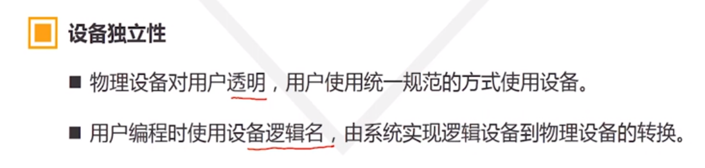
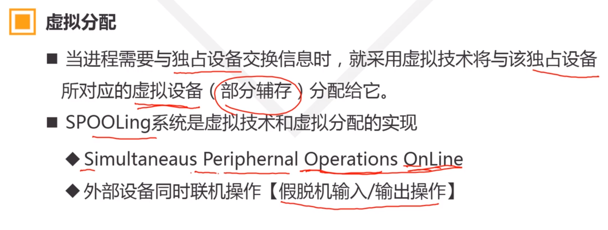

## 设备管理

1. ### 设备管理概念

   主要功能

   1. 设备分配

      设备分配功能是设备管理的基本任务

      设备分配程序按照一定的策略，为申请设备的进程分配设备，记录设备的使用情况

   2. 设备映射

      

      

   3. 设备驱动

      

      

2. #### Spooling 系统

   设备分配方法

   - 独占设备的分配
   - 共享设备的分配
   - 虚拟分配

   #### 虚拟分配

   ##### 虚拟技术

   在一类物理设备上模拟另一类物理设备的技术；借助辅存部分区域模拟独占设备，将独占设备转化为共享设备

   ##### 虚拟设备

   - 用来模拟独占设备的部分辅存称为虚拟设备，虚拟独占设备
   - 输入井：模拟输入设备的辅存区域
   - 输出井：模拟输出设备的辅存区域

   

   

   