## 文件系统

1. ### 文件系统概念

   

   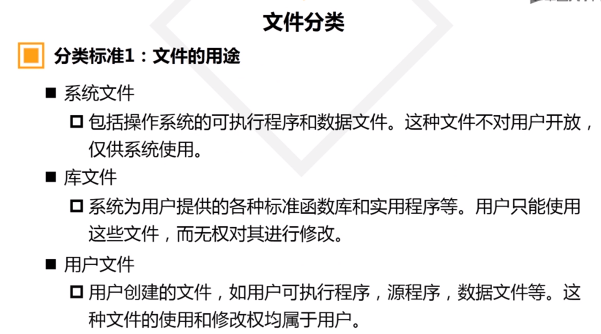

   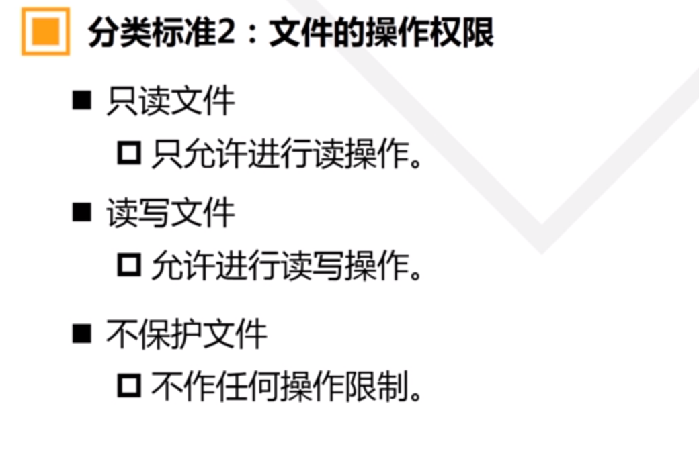

   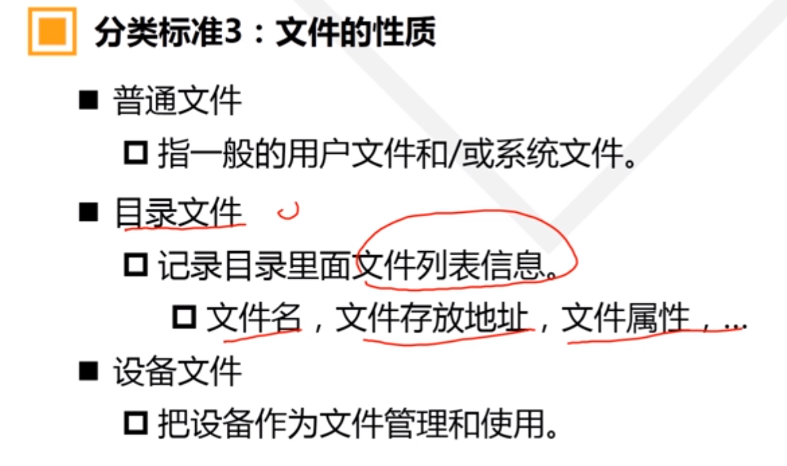

   

   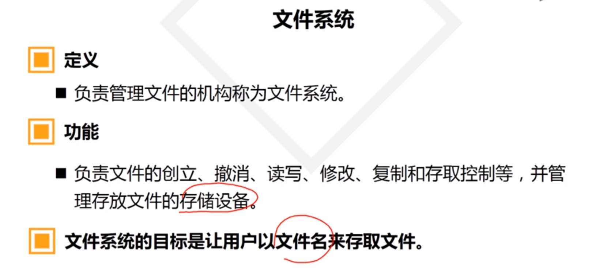

   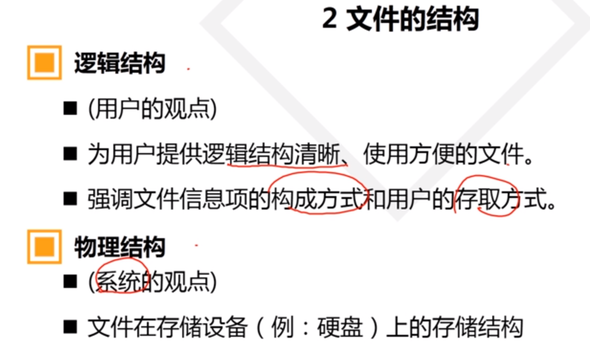

   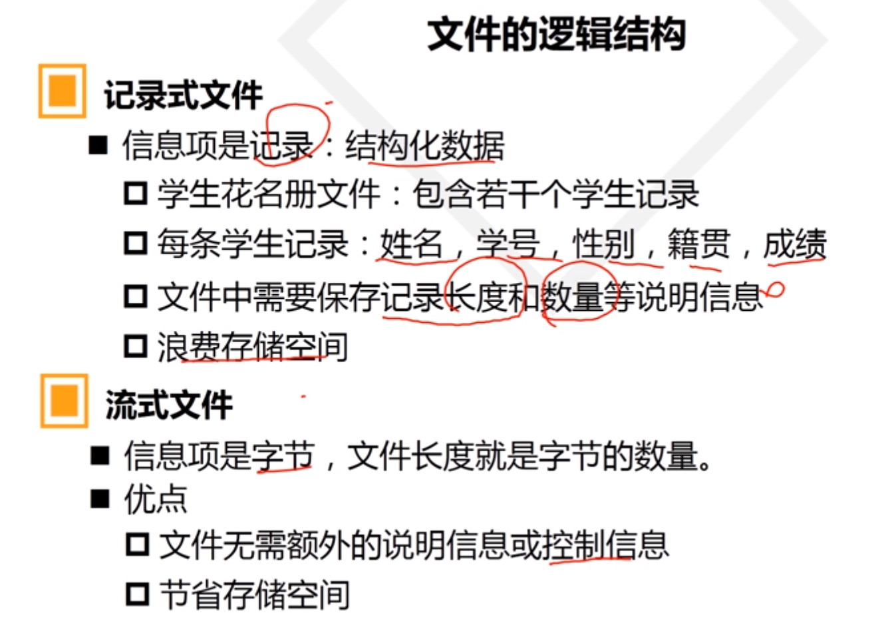

   #### 文件存取方法

   - 顺序存取

     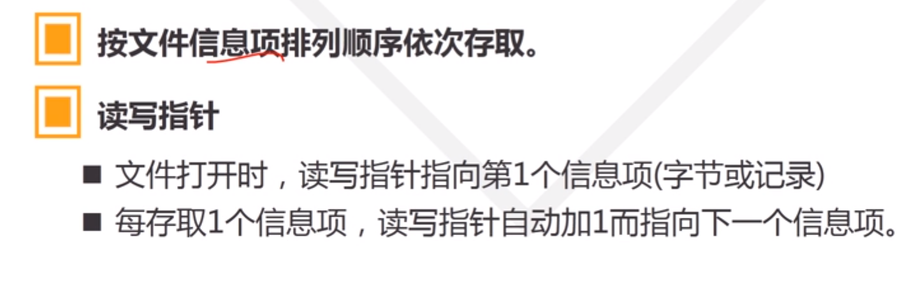

   - 随机存取

     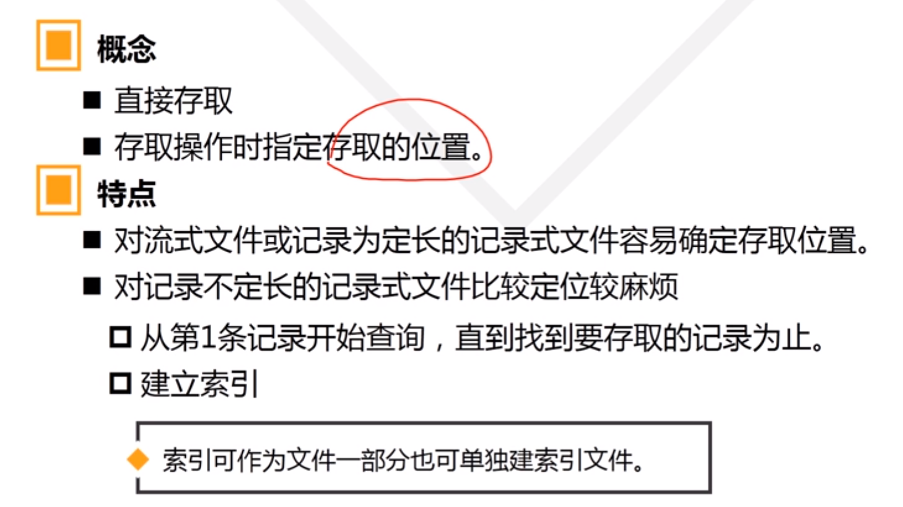

   

2. ### 文件物理结构

   #### 概念

   - 文件物理结构是指文件在存储设备上的存储方式
   - 强调合理利用存储空间，并缩短I/O存取时间

   #### 类型

   - 连续文件

     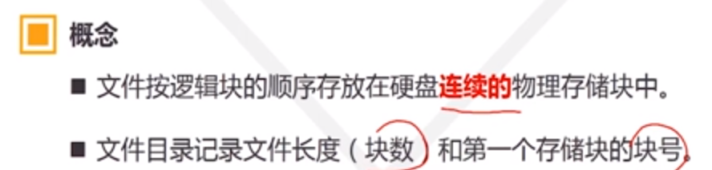

     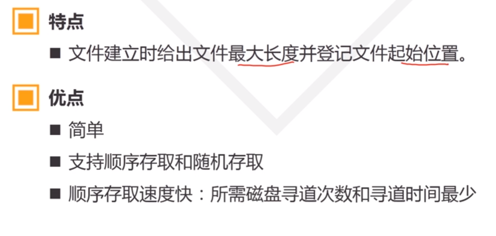

     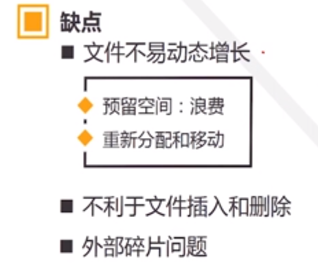

   - 索引结构

     

   - 串联文件

     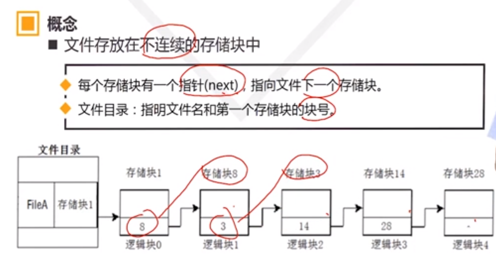

     

     

3. ### FAT文件系统——串联文件的应用

   FAT:File Allocation Table	 将next有序集中放到FAT表中。

   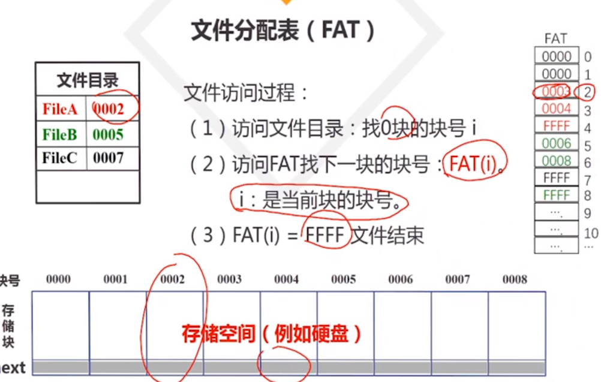

   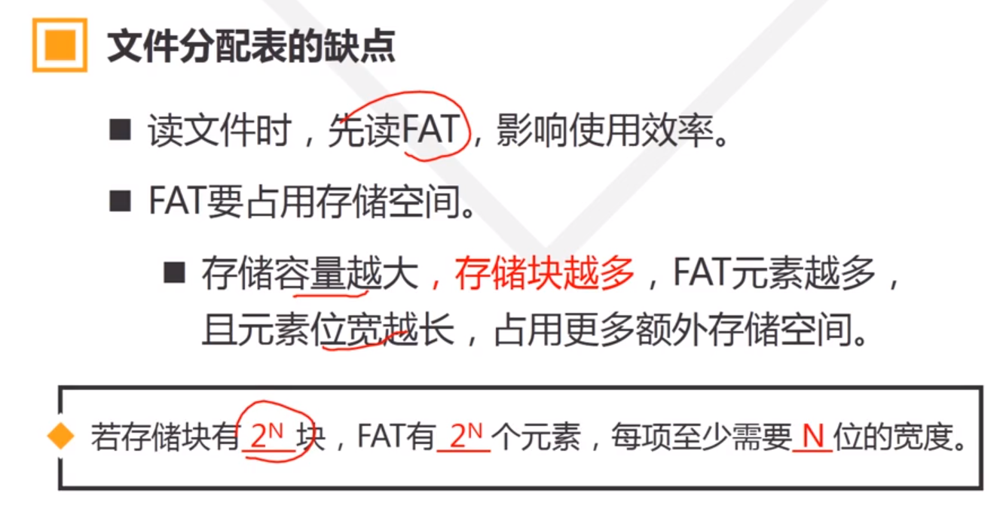

   

4. ### 文件存储和目录

   

   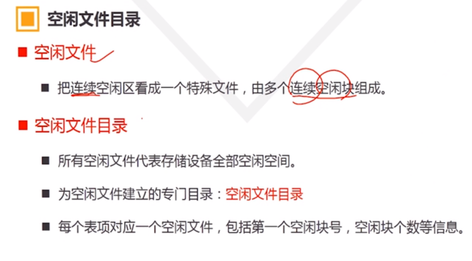

   

   

   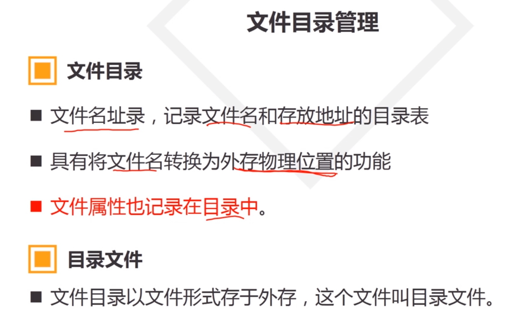

   